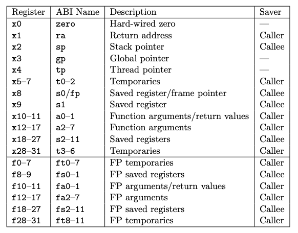

## 调用约定

增加了函数之后，需要修改的部分主要有两处：函数定义与函数调用。在生成汇编代码之前，我们需要先了解一下调用约定。

**调用约定**（calling conventions）可认为是函数调用与函数定义之间规定的一套协议，只要双方都遵循同样的协议，调用就不会出错。如果两个编译器使用的调用约定相同，它们就可以互相调用各自编译出的函数，例如要让我们的 minidecaf 程序正确调用已编译的 C 标准库的函数，就需要让我们的编译器遵循 GCC 的调用约定。

总的来说，调用约定统一了以下有关函数调用的接口：

* 参数是如何传递给**被调用者**（callee ）的？是在栈上还是寄存器上传递？
* 返回值是如何传回给**调用者**（caller ）的？
* 调用者与被调用者之间如何协调管理栈空间？
* 哪些寄存器由调用者保存？哪些由被调用者保存？

调用约定没有一套统一的标准，例如对于 x86 架构就有 cdecl、stdcall、fastcall 等多种。为了便于实现，在这里我们介绍了一套 RISC-V 的简化版调用约定，你也可以参考 GCC 的，或自己定义一套。

我们的调用约定可以概况为：

* 参数都通过栈传递，压栈顺序为从右向左。
* 返回值保存在 `a0`。
* 调用者分配和回收参数所需的栈空间，被调用者分配和回收自己的栈帧。
* 除了有特殊用途的寄存器外，`t0-t6` 是由调用者保存的，`s0-s11` 是由被调用者保存的。

以下是一些细节。

### RISC-V 寄存器



> 图片来源：https://riscv.org/wp-content/uploads/2015/01/riscv-calling.pdf

上表列出了 RISC-V 架构的所有整数寄存器和浮点寄存器。由于寄存器个数是有限的，因此它们常常需要被保存到内存中。寄存器的保存通常发生在函数调用前后，根据保存者的不同，寄存器可分为**调用者保存**（caller saved）寄存器和**被调用者保存**（callee saved）寄存器（见上表最后一列）：

* 调用者保存寄存器（或**临时寄存器**）：在函数调用前，由调用者将它们保存到栈上，并在函数调用结束后从栈上恢复，在调用前后可能被修改；
* 被调用者保存寄存器（或**保存寄存器**）：在函数调用开始后，由被调用者将它们保存到栈上，并在函数返回前从栈上恢复，在调用前后保持不变。

例如，以 `t` 开头的寄存器都是临时寄存器，在函数调用时不保留，如果调用后还要用到则需要调用者进行保存；用于存放返回值或参数的以 `a` 开头的寄存器也会在函数调用时被更改，也属于临时寄存器。而以 `s` 开头的寄存器都是保存寄存器，在函数调用时会保留原来的值，调用者无需进行保存；另外如 `sp` 之类的寄存器因在函数调用前后保持不变，也属于保存寄存器。

由于本实验不包含寄存器分配和浮点运算，我们只会用到其中很小的一部分：

* 函数返回地址 `ra`
* 栈指针 `sp`
* 栈帧指针 `fp`（或 `s0`）
* 临时寄存器：`t0-t1`（两个足够）
* 函数返回值 `a0`
* 参数寄存器 `a0-a7`（如果实现了寄存器传参）

### 参数传递

一般来说，为了提高性能，参数应尽可能通过寄存器传递。不过为了简单起见，我们规定参数全部使用栈来传递。你完全可以遵循其他调用约定使用 `a0-a7` 寄存器来传参，或是当参数个数过多时同时使用寄存器和栈来传参。

当函数调用开始前，调用者按从右到左的顺序将每个参数压入栈中。例如，对于函数调用

```c
foo(1, 2, 3);
```

压栈的顺序是：

```c
PUSH 3
PUSH 2
PUSH 1
```

当函数调用结束后，再由调用者释放栈上的这段参数空间。
